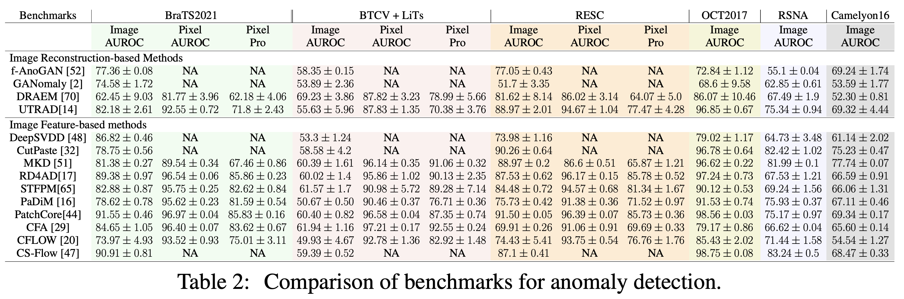

# BMAD: Benchmarks for Medical Anomaly Detection


## Original Resource Access links

| Dataset        | Download Link                                                |
| -------------- | ------------------------------------------------------------ |
| BraTS2021      | [link](https://www.kaggle.com/datasets/dschettler8845/brats-2021-task1) |
| Liver CT       | [link](data/liver/)                                 |
| RESC           | [link](https://github.com/CharlesKangZhou/P_Net_Anomaly_Detection) |
| OCT2017        | [link](https://www.kaggle.com/datasets/paultimothymooney/kermany2018) |
| RSNA           | [link](https://www.kaggle.com/competitions/rsna-pneumonia-detection-challenge/overview) |
| Histopathology | [link](data/histopathology/)                        |

| Support AD algorithm        | Access Link                                                |
| -------------- | ------------------------------------------------------------ |
| Anomalib       | [link](https://github.com/openvinotoolkit/anomalib) |
 
## Our Proposed Benchmarks 
To downlload: https://drive.google.com/drive/folders/1La5H_3tqWioPmGN04DM1vdl3rbcBez62?usp=sharing



## Train
You can train the model by running `main.py` with args. For example, if you want to train a RD4AD model on RESC dataset, you can run the following command:

```bash
python main.py --mode train --data RESC --model RD4AD
```

## Test
You can test the model by running `main.py` with args. For example, if you want to test a PaDiM model on liver dataset with weight file `results/padim/liver/run/weights/model.ckpt`, you can run the following command:

```bash
python main.py --mode test --data liver --model padim --weight results/padim/liver/run/weights/model.ckpt
```

## Change the hyperparameters
You can change the hyperparameters by modifying the config file in `config/` folder. Take the `cflow` model as an example, you can change the hyperparameters in `config/camelyon_cflow.yaml` file for cflow model on the camelyon dataset.

```yaml
...
coupling_blocks: 8
clamp_alpha: 1.9
fiber_batch_size: 64
lr: 0.0001
...
```
