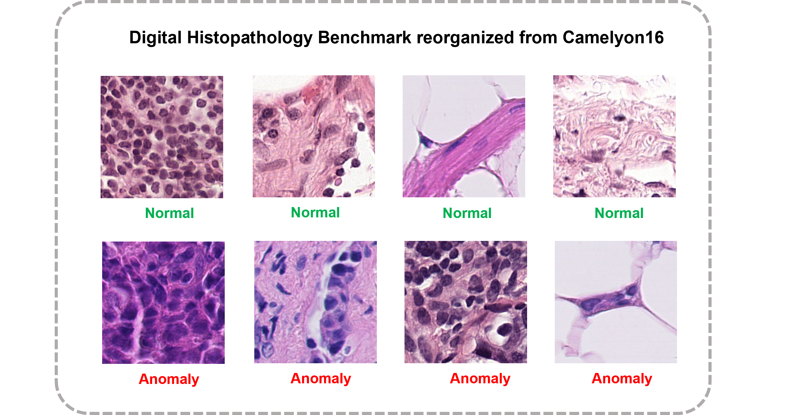

# BMAD: Benchmarks for Medical Anomaly Detection
Jinan Bao, Hanshi Sun, Hanqiu Deng, Yinsheng He, Zhaoxiang Zhang, Xingyu Li†

(† Corresponding authors)

Our paper is summitted arVix. 


## Overview
In medical imaging, AD is especially vital for detecting and diagnosing anomalies that may indicate rare diseases or conditions. However, there is a lack of a universal and fair benchmark for evaluating AD methods on medical images, which hinders the development of more generalized and robust AD methods in this specific domain. To bridge this gap, we introduce a comprehensive evaluation benchmark for assessing anomaly detection methods on medical images. This benchmark encompasses six reorganized datasets from five medical domains (i.e. brain MRI, liver CT, retinal OCT, chest X-ray, and digital histopathology) and three key evaluation metrics, and includes a total of fourteen state-of-the-art AD algorithms. This standardized and well-curated medical benchmark with the well-structured codebase enables comprehensive comparisons among recently proposed anomaly detection methods. It will facilitate the community to conduct a fair comparison and advance the field of AD on medical imaging.

## Original Resource Access links

| Dataset        | Download Link                                                |
| -------------- | ------------------------------------------------------------ |
| Brain MRI Anomaly Detection and Localization Benchmark | [BraTS2021 Dataset](http://braintumorsegmentation.org/)                   |
| Liver CT Anomaly Detection and Localization Benchmark | [BTCV Dtaset](https://www.synapse.org/#!Synapse:syn3193805/wiki/217753) + [LiTS Dataset](https://www.kaggle.com/datasets/andrewmvd/liver-tumor-segmentation)   |
| Retinal OCT Anomaly Detection and Localization Benchmark | [RESC](https://github.com/CharlesKangZhou/P_Net_Anomaly_Detection) + [OCT2017](https://www.kaggle.com/datasets/paultimothymooney/kermany2018) |
| Chest X-ray Anomaly Detection Benchmark                  | [RSNA dataset](https://www.kaggle.com/competitions/rsna-pneumonia-detection-challenge/overview) |
| Digital Histopathology Anomaly Detection Benchmark       | [Camelyon16 Dataset](https://camelyon17.grand-challenge.org/Data/)                        |
 

| Support AD algorithm and the original implementation        | Details                                               |
| -------------- | ------------------------------------------------------------ |
| [anomalib](https://github.com/openvinotoolkit/anomalib) |We used their support for industrial AD work: [RD4AD](https://arxiv.org/pdf/2201.10703v2.pdf), [DRAEM](https://arxiv.org/pdf/2108.07610v2.pdf), [GANomaly](https://arxiv.org/abs/1805.06725), [PaDiM](https://arxiv.org/pdf/2011.08785.pdf), [PatchCore](https://arxiv.org/pdf/2106.08265.pdf), [STFPM](https://arxiv.org/pdf/2103.04257.pdf), [CFLOW](https://openaccess.thecvf.com/content/WACV2022/papers/Gudovskiy_CFLOW-AD_Real-Time_Unsupervised_Anomaly_Detection_With_Localization_via_Conditional_Normalizing_WACV_2022_paper.pdf) and [CFA](https://arxiv.org/abs/2206.04325)|
| [DeepSVDD](http://proceedings.mlr.press/v80/ruff18a.html) | We used a PyTorch Implementation of Deep SVDD: [lukasruff/Deep-SVDD-PyTorch](https://github.com/lukasruff/Deep-SVDD-PyTorch) |
| [f-AnoGAN](https://www.sciencedirect.com/science/article/pii/S1361841518302640) | We used a PyTorch Implementation of f-AnoGAN: [A03ki/f-AnoGAN](https://github.com/A03ki/f-AnoGAN) |
| [MKD](https://arxiv.org/pdf/2011.11108.pdf)      |  We used official Implementation of MKD: [rohban-lab/Knowledge_Distillation_AD](https://github.com/rohban-lab/Knowledge_Distillation_AD) |
| [Cutpaste](https://arxiv.org/abs/2104.04015) | We used a PyTorch Implementation CutPaste: [Runinho/pytorch-cutpaste](https://github.com/Runinho/pytorch-cutpaste) |
| [CS-Flow](https://arxiv.org/pdf/2110.02855.pdf) | We used official Implementation of CS-Flow:  [marco-rudolph/cs-flow](https://github.com/marco-rudolph/cs-flow) |
| [UTRAD](https://www.sciencedirect.com/science/article/pii/S0893608021004810) | We used official Implementation of UTRAD: [gordon-chenmo/UTRAD](https://github.com/gordon-chenmo/UTRAD) |

## Our BMAD datasets
To download the reorganization: https://drive.google.com/drive/folders/1La5H_3tqWioPmGN04DM1vdl3rbcBez62?usp=sharing

Our dataset includes image-level only and image-level&pixel-level. Take the camelyon16 dataset(image level) as an example, the reorganization is as follows:

```text
camelyon16
├── train
    ├── good
        ├── 1000.png
        ├── 1001.png
        ├── ...
├── valid
    ├── good
        ├── 1080.png
        ├── 1081.png
        ├── ...
    ├── Ungood
        ├── 1000.png
        ├── 1001.png
        ├── ...
    
├── test
    ├── good
        ├── 1000.png
        ├── 1001.png
        ├── ...
    ├── Ungood
        ├── 100.png
        ├── 101.png
        ├── ...
```

Take the BraTs2021 dataset(image&pixel level) as an example, the reorganization is as follows:

```text
Brain
├── train
    ├── good
        ├── img
            ├── 00003_60.png
            ├── 00003_61.png
            ├── ...
├── valid
    ├── good
        ├── img
            ├── 00025_99.png
            ├── 00100_60.png
            ├── ...
    ├── Ungood
        ├── img
            ├── 00124_60.png
            ├── 00124_70.png
            ├── ...
        ├── label
            ├── 00124_60.png
            ├── 00124_70.png
            ├── ...
├── test
    ├── good
        ├── img
            ├── 00000_96.png
            ├── 00000_97.png
            ├── ...
    ├── Ungood
        ├── img
            ├── 00002_60.png
            ├── 00002_68.png
            ├── ...
        ├── label
            ├── 00002_60.png
            ├── 00002_68.png
            ├── ...
```

To download all trained checkpoints: 

## Intoruction for medical domains

### BraTS2021
The original BraTS2021 dataset is proposed for a multimodel brain tumor segmentation challenge. It provides 1,251 cases in the training set, 219 cases in validation set, 530 cases in testing set (nonpublic), all stored in NIFTI (.nii.gz) format. Each sample includes 3D volumes in four modalities: native (T1) and post-contrast T1-weighted (T1Gd), T2-weighted (T2), and T2 Fluid Attenuated Inversion Recovery (T2-FLAIR), accompanied by a 3D brain tumor segmentation annotation. The data size for each modality is 240x240x155. 

**Access and License:** The BraTS2021 dataset can be accessed at [http://braintumorsegmentation.org](http://braintumorsegmentation.org/). Registration for the challenge is required. As stated on the challenge webpage, "Challenge data may be used for all purposes, provided that the challenge is appropriately referenced using the citations given at the bottom of this page."


### BTCV Dataset
BTCV is introduced for multi-organ segmentation. It consists of 50 abdominal computed tomography (CT) scans taken from patients diagnosed with colorectal cancer and a retrospective ventral hernia. The original scans were acquired during the portal venous contrast phase and had variable volume sizes ranging from 512x512x85 to 512x512x198 and stored in `nii.gz` format. 

**Access and License:** The original BTCV dataset can be accessed from `RawData.zip` at [https://www.synapse.org/#!Synapse:syn3193805/wiki/217753](https://www.synapse.org/\#!Synapse:syn3193805/wiki/217753).
Dataset posted on Synapse is subject to the Creative Commons Attribution 4.0 International (CC BY 4.0) license.


### LiTS Dataset
LiTS is proposed for liver tumor segmentation. It originally comprises 131 abdominal CT scans, accompanied by a ground truth label for the liver and liver tumors. The original LiTS is stored in the `nii.gz` format with a volume size of 512x512x432. 

**Access and License:** LiTS can be downloaded from its Kaggle webpage at [https://www.kaggle.com/datasets/andrewmvd/liver-tumor-segmentation]({https://www.kaggle.com/datasets/andrewmvd/liver-tumor-segmentation). The use of the LiTS dataset is under Creative Commons Attribution-NonCommercial-ShareAlike(CC BY-NC-SA).

### RESC dataset
RESC (Retinal Edema Segmentation Challenge) dataset specifically focuses on the detection and segmentation of retinal edema anomalies. It provides pixel-level segmentation labels, which indicate the regions affected by retinal edema. The RESC is provided in PNG format with a size of 512*1024 pixels.

**Access and License:** The original RESC dataset can be downloaded from the P-Net github page at [https://github.com/CharlesKangZhou/P_Net_Anomaly_Detection](https://github.com/CharlesKangZhou/P_Net_Anomaly_Detection). As indicated on the webpage, the dataset can be only used for the research community.


### OCT2017 dataset
OCT2017 is a large-scale dataset initially designed for classification tasks. It consists of retinal OCT images categorized into three types of anomalies: Choroidal Neovascularization (CNV), Diabetic Macular Edema (DME), and Drusen Deposits (DRUSEN). The images are continuous slices with a size of 512*496. 

**Access and License:** OCT2017 can be downloaded at [https://data.mendeley.com/datasets/rscbjbr9sj/2](https://data.mendeley.com/datasets/rscbjbr9sj/2). Its usage is under a license of Creative Commons Attribution 4.0 International(CC BY 4.0).

### RSNA dataset
RSNA, short for RSNA Pneumonia Detection Challenge, is originally provided for a lung pneumonia detection task. The 26,684 lung images are associated with three labels: "Normal" indicates a normal lung condition, "Lung Opacity" indicates the presence of pneumonia, "No Lung Opacity/Not Normal" represents a third category where some images are determined to not have pneumonia, but there may still be some other type of abnormality present in the image. All images in RSNA are in DICOM format.

**Access and License:** RSNA can be accessed by [https://www.kaggle.com/competitions/rsna-pneumonia-detection-challenge/overview](https://www.kaggle.com/competitions/rsna-pneumonia-detection-challenge/overview). Stated in the section of Competition data: A. Data Access and Usage, "... you may access and use the Competition Data for the purposes of the Competition, participation on Kaggle Website forums, academic research and education, and other non-commercial purposes."


### Camelyon16 Dataset
The Camelyon16 dataset was initially utilized in the Camelyon16 Grand Challenge to detect and classify metastatic breast cancer in lymph node tissue. It comprises 400 whole-slide images (WSIs) of lymph node sections stained with hematoxylin and eosin (H\&E) from breast cancer patients. Among these WSIs, 159 of them exhibit tumor metastases, which have been annotated by pathologists. The WSIs are stored in standard TIFF files, which include multiple down-sampled versions of the original image. In Camelyon16, the highest resolution available is on level 0, corresponding to a magnification of 40X.

**Access and Licence:** The original Camelyon16 dataset can be found at [https://camelyon17.grand-challenge.org/Data/](https://camelyon17.grand-challenge.org/Data/).
It is under a license of Creative Commons Zero 1.0 Universal Public Domain Dedication([CC0](https://registry.opendata.aws/camelyon/)).



## How to use our work
### Train
You can train the model by running `main.py` with args. For example, if you want to train a RD4AD model on RESC dataset, you can run the following command:

```bash
python main.py --mode train --data RESC --model RD4AD
```

### Test
You can test the model by running `main.py` with args. For example, if you want to test a PaDiM model on liver dataset with weight file `results/padim/liver/run/weights/model.ckpt`, you can run the following command:

```bash
python main.py --mode test --data liver --model padim --weight results/padim/liver/run/weights/model.ckpt
```

### Change the hyperparameters
You can change the hyperparameters by modifying the config file in `config/` folder. Take the `cflow` model as an example, you can change the hyperparameters in `config/camelyon_cflow.yaml` file for cflow model on the camelyon dataset.

```yaml
...
coupling_blocks: 8
clamp_alpha: 1.9
fiber_batch_size: 64
lr: 0.0001
...
```
### Thanks
Our orgianl datasets and support alogorithms are come from the above resources, thanks their splendid works!
